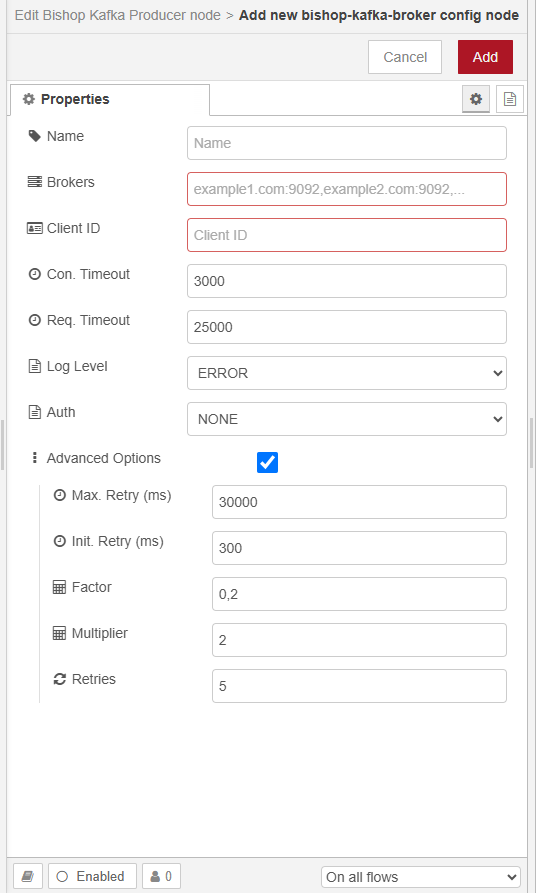

# node-red-bishop-kafka

Node-RED nodes for Apache Kafka integration. This library depends on [confluent-kafka-javascrip](https://github.com/confluentinc/confluent-kafka-javascript)

It consists in 3 nodes:
- Broker (config node)
- Producer
- Consumer


## Broker




## Producer


The producer also accepts the following properties:
- Topic: msg.topic
- Partition: msg.partition
- Key: msg.key
- Headers: msg.headers

NB: config properties have priority over properties passed in the message `config.topic > msg.topic`


## Consumer


The consumer has an input which accepts a `payload` object with the following types

### pause event
Pause the consumer for the topic in consumer config

```typescript
{
  event: "pause";
}
```

### resume event
Resume the consumer for the topic in consumer config

```typescript
{
  event: "resume";
}
```

### seek event
Change the offset the consumer is reading from
```typescript
{
  event: "pause";
  offset: number;
  partition: number;
}
```


### commit event
Commit a specific message

```typescript
{
  event: "commit";
  partition: number;
  offset: number;
  topic: string;
}
```


When the consumer subscribe to a Kafka broker and poll a message succesfuly, it returns a msg object of the following type:
``` typescript
{
  payload: {
    key: Buffer | JSON | string;
    value: Buffer | JSON | string;
    headers: {[key: string]: Buffer | string | (Buffer | string)[] | undefined }
  },
  bishop: {
    kafka: {
      topic: string;
      partition: number;
      offset: string;
    }
  }
}
```